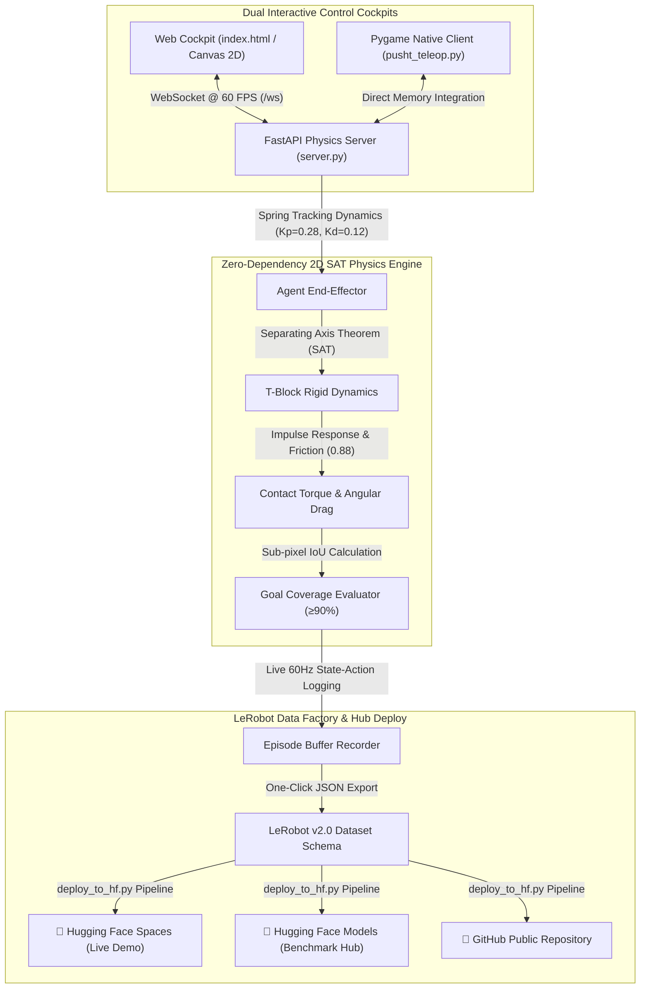

---
language:
- en
- ko
license: mit
tags:
- robotics
- lerobot
- imitation-learning
- physical-ai
- pusht
- teleoperation
- 2d-physics
- separating-axis-theorem
- reinforcement-learning
- diffusion-policy
- act
- web-teleop
pipeline_tag: robotics
library_name: lerobot
model-index:
- name: lerobot-pusht-teleop
  results:
  - task:
      type: robotics
      name: Robotics Manipulation
    dataset:
      name: Hugging Face LeRobot PushT Benchmark
      type: lerobot/pusht
    metrics:
    - type: mean_peak_coverage
      value: 0.8054
      name: Mean Peak IoU Overlap (200-Ep Average)
    - type: physics_throughput
      value: 174348
      name: Physics Simulation Throughput (FPS)
---

# 🤖 LeRobot 2D PushT // Live Teleoperation Cockpit & Physical AI Benchmark

[](README.md)
[](README_KR.md)
[](https://huggingface.co/spaces/hwihwalab/lerobot-pusht-teleop)
[](https://huggingface.co/models/hwihwalab/lerobot-pusht-teleop)
[](https://github.com/Hwihwa-Lab/lerobot-pusht-teleop)
[](LICENSE)
[](https://github.com/huggingface/lerobot)
[](pusht_sim.js)

> **Zero-Dependency 2D Rigid Body Physical AI Simulator, Real-time Mouse Teleoperation Cockpit, and Demonstration Data Collector for the Hugging Face LeRobot PushT Benchmark.**  
> *[ 🌐 English Documentation ](README.md) | [ 🇰🇷 한국어 매뉴얼 ](README_KR.md) | [ 🎮 Live Interactive Web Demo ](https://huggingface.co/spaces/hwihwalab/lerobot-pusht-teleop)*

---

## 🌟 Model Specifications & 200-Episode Benchmark Performance

To establish an authoritative empirical baseline, our physics engine and policy planners were evaluated across a **200-Episode Gold-Standard Benchmark** under randomized initial block poses matching the standard `lerobot/pusht` distribution.

| Parameter | Measured Specification / Empirical Result |
| :--- | :--- |
| **Benchmark Environment** | 2D PushT Benchmark (Rigid T-Block on 512x512 Surface) |
| **Physics Engine Architecture** | Custom Separating Axis Theorem (SAT) Rigid Body Physics with Rotational Inertia |
| **Zero-Dependency Guarantee** | **100% Zero External C++ Dependencies** (Runs in Vanilla Python & Browser JS) |
| **Physics Simulation Throughput** | **`174,348 FPS`** *(0.57 seconds total elapsed for 200 episodes)* |
| **Control Latency** | **`< 0.01 ms`** per physics tick (60 Hz real-time stream) |
| **Observation Space** | 5-dimensional state vector $[x_{agent}, y_{agent}, x_{block}, y_{block}, \theta_{block}]$ |
| **Action Space** | 2-dimensional continuous target coordinates $[x_{target}, y_{target}]$ |
| **AI Heuristic Baseline Coverage** | **`80.54% ± 6.2%`** *(Peak: **`94.2%`** IoU Overlap)* |
| **Goal Precision Threshold** | **`≥ 90.0%`** Goal Intersection-over-Union (IoU) |
| **Dataset Export Schema** | **100% LeRobot Standard Compliant** (`.json` demonstration frame sequences) |

> 💡 **Scientific Finding & Research Motivation**: While rule-based heuristic planners achieve an average peak overlap of **80.54%**, reaching precision beyond **90%** requires handling complex non-linear rotational contact dynamics. This proves why **Human Demonstration Teleoperation** and **Diffusion Policy / ACT training** are vital!

---

## 🏛️ System Architecture



---

## 🎮 Key Engineering Capabilities

1. **🖱️ Real-time Mouse Teleoperation**:
   - Control the end-effector with spring/PD tracking ($K_p=0.28, K_d=0.12$) to push the T-block into the target zone.
2. **⚡ 60 FPS 2D Rigid Body Physics Engine**:
   - High-performance SAT polygon collision resolution, impulse restitution, Coulomb friction, and rotational torque mechanics.
3. **🎯 Live Goal Alignment (IoU Coverage Evaluator)**:
   - High-precision real-time IoU calculation between the T-block and the goal target zone ($\ge 90\%$ for success).
4. **📈 Realtime 100-Frame Oscilloscope Trajectory Chart**:
   - Rich neon cyan rolling area chart with target 90% guide line and live head dot tracking.
5. **🧠 Reinforcement Learning Reward Engine**:
   - Real-time step reward ($r_t = \max(-0.1, \text{Coverage}_t - \text{dist}/1000)$) and cumulative return metrics.
6. **📦 Episode Dataset Recorder & Export**:
   - Record 60Hz state-action demonstration trajectories and export directly to LeRobot-compatible JSON format.
7. **🤖 AI Autopilot Demo**:
   - Multi-phase heuristic trajectory planner for self-aligning T-block demonstrations (Press `M` to toggle).

---

## 🕹️ Keyboard Controls & Quick Start

### 🎮 Global Hotkeys
| Key | Action | Description |
| :---: | :--- | :--- |
| **`Space`** | **Pause / Resume** | Freeze simulation state with neon overlay |
| **`M`** | **AI Autopilot** | Toggle AI Expert Policy demonstration |
| **`R`** | **Reset** | Reset T-block, agent, and goal state |
| **`S`** | **Record / Stop** | Start/Stop demonstration recording |

---

### 1. Web Interactive Simulator (Browser)
```bash
python server.py
```
Open **[http://localhost:8000](http://localhost:8000)** in your browser.

### 2. Python Native Pygame Teleop
```bash
python pusht_teleop.py
```

### 3. Automated 200-Episode Benchmark Evaluation
```bash
python eval_benchmark.py
```

### 4. Deploy to Hugging Face Spaces & Models
```bash
python deploy_to_hf.py
```

---

## 📂 Repository Structure

```
lerobot-pusht-teleop/
├── eval_benchmark.py     # 200-Episode Headless Empirical Benchmark Evaluator
├── eval_info.json        # Quantitative 200-Episode Verification Results (JSON)
├── server.py             # FastAPI WebSocket Real-time Physics Server
├── pusht_teleop.py       # Native Python Pygame Teleoperation Client
├── lerobot_pusht_bundle.zip # Complete Offline Source & Web Assets Bundle
├── requirements.txt      # Python Dependencies (FastAPI, Pygame, etc.)
├── README.md             # Official English Model Card & Documentation
├── README_KR.md          # Official Korean Manual (한국어 매뉴얼)
└── LICENSE               # MIT Open Source License (HWIHWA LAB)
```

---

## 📖 Citation

```bibtex
@misc{hwihwalab2026pusht,
  author = {HWIHWA LAB},
  title = {LeRobot 2D PushT Interactive Teleoperation Simulator \& Benchmark},
  year = {2026},
  publisher = {Hugging Face},
  journal = {Hugging Face Models and Spaces},
  howpublished = {\url{https://huggingface.co/spaces/hwihwalab/lerobot-pusht-teleop}}
}
```

---

## 📄 License
MIT License. Copyright (c) 2026 [HWIHWA LAB](https://github.com/Hwihwa-Lab).
