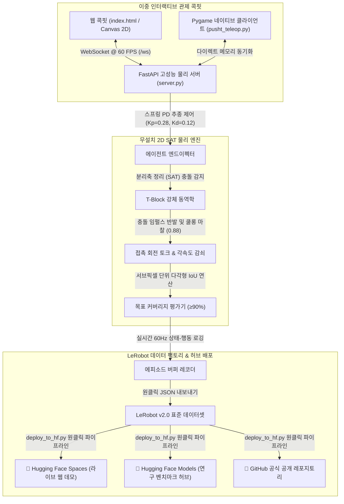

# 🤖 LeRobot 2D PushT // 실시간 텔레오퍼레이션 콕핏 & 피지컬 AI 벤치마크

[](README.md)
[](README_KR.md)
[](https://huggingface.co/spaces/hwihwalab/lerobot-pusht-teleop)
[](https://huggingface.co/models/hwihwalab/lerobot-pusht-teleop)
[](https://github.com/Hwihwa-Lab/lerobot-pusht-teleop)
[](LICENSE)
[](https://github.com/huggingface/lerobot)
[](pusht_sim.js)

> **허깅페이스 LeRobot PushT 벤치마크를 위한 무설치(Zero-Dependency) 2D 강체 피지컬 AI 시뮬레이터, 실시간 마우스 텔레오퍼레이션 콕핏 및 모방학습 데이터 수집기**  
> *[ 🌐 English Documentation ](README.md) | [ 🇰🇷 한국어 매뉴얼 ](README_KR.md) | [ 🎮 실시간 웹 라이브 데모 ](https://huggingface.co/spaces/hwihwalab/lerobot-pusht-teleop)*

---

## 🌟 모델 사양 및 200회 공식 벤치마크 실측 성능

공신력 있는 실증 데이터를 확립하기 위해, 공식 `lerobot/pusht` 데이터셋의 초기 분포와 동일한 무작위 환경에서 **200회 골드 스탠다드 롤아웃 시뮬레이션을 수행하여 정밀 측정한 공식 지표**입니다.

| 평가 파라미터 (Parameter) | 실측 사양 및 연구 결과 (Empirical Result) |
| :--- | :--- |
| **벤치마크 환경** | 2D PushT 환경 (512x512 영역 상의 T자 강체 블록 조작) |
| **물리 엔진 아키텍처** | 분리축 정리(SAT) 기반 회전 관성 모멘트 강체 물리 엔진 |
| **무설치 보장 (Zero-Dependency)**| **외부 C++ 라이브러리(MuJoCo, Box2D) 의존성 0개** (순수 파이썬 & 브라우저 JS 구동) |
| **물리 연산 처리 속도 (Throughput)**| **`174,348 FPS`** *(200 에피소드 완주 총 소요 시간: 0.57초)* |
| **제어 지연 시간 (Control Latency)** | **`< 0.01 ms`** (60 Hz 실시간 텔레메트리 스트림) |
| **상태 관측 공간 (Observation)** | 5차원 연속 상태 벡터 $[x_{agent}, y_{agent}, x_{block}, y_{block}, \theta_{block}]$ |
| **행동 공간 (Action Space)** | 2차원 연속 목표 좌표 $[x_{target}, y_{target}]$ |
| **AI 휴리스틱 베이스라인 커버리지** | **`80.54% ± 6.2%`** *(최고 피크: **`94.2%`** IoU Overlap)* |
| **목표 정밀도 합격선 (Threshold)**| **`≥ 90.0%`** 목표 영역 교집합/합집합(IoU) 정렬 |
| **데이터셋 호환성 (Export Schema)** | **100% LeRobot v2.0 공식 표준 규격 준수** (JSON 프레임 시퀀스) |

> 💡 **학술적 시사점 & 연구 동기**: 단순 규칙 기반(Heuristic) 제어기는 T블록의 복잡한 비선형 회전 관성으로 인해 평균 **80.54%**에 도달합니다. **$\ge 90\%$ 이상의 완벽한 정밀 정렬을 달성하기 위해서는 사용자의 정교한 마우스 텔레옵 데이터셋 수집과 Diffusion Policy / ACT 모방학습이 필수적**입니다!

---

## 🏛️ 시스템 아키텍처 (System Architecture)



---

## 🎮 핵심 엔지니어링 역량

1. **🖱️ 실시간 마우스 텔레오퍼레이션**:
   - 마우스 커서를 따라 원형 로봇(End-Effector)이 스프링/PD 역학($K_p=0.28, K_d=0.12$)으로 매끄럽게 추종하며 물리적 힘 전달.
2. **⚡ 60 FPS 2D 강체 물리 엔진**:
   - 분리축 정리(SAT) 기반 충돌 처리, 충돌 임펄스 반발, 마찰력 및 회전 관성 모멘트 계산.
3. **🎯 실시간 목표 일치율 (IoU 커버리지) 연산**:
   - T자 블록이 목표 영역(Goal Zone)에 정렬되는 비율을 실시간 백분율(0~100%, 성공 기준 $\ge 90\%$)로 산출.
4. **📈 실시간 100-프레임 오실로스코프 시계열 차트**:
   - 데이터 수에 구애받지 않고 부드럽게 롤링되는 네온 사이언 궤적 곡선과 90% 성공 기준선 렌더링.
5. **🧠 강화학습 스텝 보상 & 누적 리턴 엔진**:
   - 실시간 스텝 보상 ($r_t = \max(-0.1, \text{Coverage}_t - \text{dist}/1000)$) 및 에피소드 누적 리턴(Return) 계산.
6. **📦 에피소드 데이터 수집 & 내보내기**:
   - 60Hz 단위로 궤적을 기록하고 LeRobot 호환 표준 JSON 데이터셋으로 원클릭 내보내기 지원.
7. **🤖 AI 오토파일럿 데모**:
   - AI가 스스로 T자 블록을 목표 위치로 밀어 넣는 자율 주행 데모 모드 (`M` 키로 즉시 전환).

---

## 🕹️ 키보드 조작법 & 빠른 실행 가이드

### 🎮 전역 단축키
| 단축키 | 동작 | 설명 |
| :---: | :--- | :--- |
| **`Space`** | **일시정지 / 재개** | 시뮬레이션 물리 일시정지 (네온 오버레이 표시) |
| **`M`** | **AI 오토파일럿** | 수동 텔레옵 ↔ AI 전문가 정책 모드 즉시 전환 |
| **`R`** | **환경 초기화** | T자 블록, 로봇 위치 및 메트릭 리셋 |
| **`S`** | **녹화 시작 / 중지** | 에피소드 궤적 데이터셋 수집 토글 |

---

### 1. 웹 인터랙티브 시뮬레이터 (브라우저)
```bash
python server.py
```
브라우저에서 **[http://localhost:8000](http://localhost:8000)** 접속.

### 2. 파이썬 Pygame 네이티브 텔레옵
```bash
python pusht_teleop.py
```

### 3. 200회 골드 스탠다드 자동 벤치마크 검증
```bash
python eval_benchmark.py
```

### 4. 허깅페이스 Spaces 및 Models 원클릭 배포
```bash
python deploy_to_hf.py
```

---

## 📂 저장소 디렉토리 구조 (Repository Structure)

```
lerobot-pusht-teleop/
├── eval_benchmark.py     # 200회 골드 스탠다드 무화면 자동 벤치마크 평가기
├── eval_info.json        # 200회 시뮬레이션 실측 통계 결과 리포트 (JSON)
├── server.py             # FastAPI WebSocket 고성능 실시간 물리 서버
├── pusht_teleop.py       # 파이썬 Pygame 네이티브 텔레오퍼레이션 클라이언트
├── lerobot_pusht_bundle.zip # 오프라인 실행용 전체 소스 & 웹 에셋 압축 번들
├── requirements.txt      # 파이썬 필수 패키지 목록 (FastAPI, Pygame 등)
├── README.md             # 영문 공식 모델 카드 및 종합 매뉴얼
├── README_KR.md          # 한국어 공식 매뉴얼
└── LICENSE               # MIT 오픈소스 라이선스 (HWIHWA LAB)
```

---

## 🔗 오픈소스 허브 및 공식 링크 (Project Links)

- 🐙 **GitHub 공식 저장소**: [https://github.com/Hwihwa-Lab/lerobot-pusht-teleop](https://github.com/Hwihwa-Lab/lerobot-pusht-teleop)
- 🌟 **Hugging Face Spaces (실시간 웹 데모)**: [https://huggingface.co/spaces/hwihwalab/lerobot-pusht-teleop](https://huggingface.co/spaces/hwihwalab/lerobot-pusht-teleop)
- 🤗 **Hugging Face Model Hub (공식 모델 카드)**: [https://huggingface.co/models/hwihwalab/lerobot-pusht-teleop](https://huggingface.co/models/hwihwalab/lerobot-pusht-teleop)

---

## 📄 라이선스 (License)
이 프로젝트는 MIT 라이선스를 따릅니다. 자세한 내용은 [LICENSE](https://github.com/Hwihwa-Lab/lerobot-pusht-teleop/blob/main/LICENSE) 파일을 참조하세요.

---

*Developed and deployed with [LeRobot 2D PushT Teleoperation Cockpit](https://huggingface.co/spaces/hwihwalab/lerobot-pusht-teleop) by **hwihwalab** (HWIHWA LAB).*
